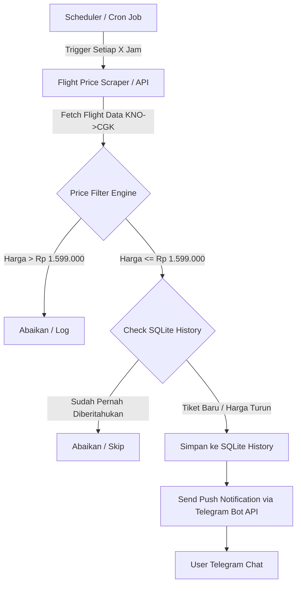

# Product Requirement Document (PRD): Automated Flight Ticket Price Tracker & Telegram Notifier

## 1. Ringkasan Eksekutif (Executive Summary)
Sistem **Flight Price Tracker & Telegram Notifier** adalah aplikasi otomasi yang memantau harga tiket pesawat **sekali jalan (one-way)** secara berkala untuk rute **Kualanamu International Airport (KNO - Medan)** menuju **Soekarno-Hatta International Airport (CGK - Jakarta)** pada rentang tanggal **17 - 20 September 2026**. 

Sistem akan memberikan notifikasi seketika (*real-time push notification*) via **Telegram Bot** ketika menemukan tiket pesawat dengan harga terjangkau (*affordable*) di rentang harga **Rp 1.300.000 - Rp 1.599.000** (atau lebih murah).

---

## 2. Tujuan & Kriteria Keberhasilan (Goals & Success Criteria)
- **Tujuan Utama**: Memastikan pengguna mendapatkan harga tiket terbaik untuk perjalanan KNO -> CGK tanggal 17, 18, 19, atau 20 September 2026 tanpa perlu pengecekan manual secara rutin.
- **Kriteria Keberhasilan**:
  1. Pengikisan / pengambilan data harga tiket berjalan otomatis secara berkala (misal: setiap 1 - 3 jam).
  2. Filter harga bekerja secara akurat sesuai threshold (<= Rp 1.599.000).
  3. Notifikasi Telegram terkirim lengkap dengan detail maskapai, jam keberangkatan, tanggal, harga, dan tautan pemesanan.
  4. Mencegah spam notifikasi (hanya mengirim notifikasi jika ada penurunan harga baru atau penerbangan baru yang masuk kriteria).

---

## 3. Cakupan Fitur (Scope of Features)

### 3.1. Core Features (Fitur Utama)
1. **Flight Search Engine & Scraper / API Integration**:
   - Pemantauan otomatis rute KNO -> CGK.
   - Pengecekan 4 tanggal spesifik:
     - 17 September 2026
     - 18 September 2026
     - 19 September 2026
     - 20 September 2026
   - Ekstraksi informasi: Nama Maskapai, Jam Keberangkatan & Kedatangan, Durasi Penerbangan, Harga Tiket, serta Link Pemesanan.

2. **Price Filter & Alert Logic**:
   - Target Harga: Rp 1.300.000 s/d Rp 1.599.000.
   - Kategori Alert:
     - 🟢 **DEAL BAGUS**: Harga Rp 1.300.000 - Rp 1.450.000
     - 🟡 **DEAL MUKRIM / TARGET**: Harga Rp 1.451.000 - Rp 1.599.000
     - 🚨 **SUPER CHEAP**: Harga < Rp 1.300.000 (jika ada promo mendadak)

3. **Telegram Notification System**:
   - Integrasi Telegram Bot API.
   - Pesan tersusun rapi (*formatted Markdown*) dengan informasi lengkap dan tombol / link langsung ke penyedia tiket.
   - Fitur test notification (`/test`) & status check via chat command Telegram.

4. **Alert History & Anti-Spam Database (SQLite / JSON)**:
   - Menyimpan histori harga tiket yang sudah pernah dinotifikasikan.
   - Mencegah pengiriman pesan berulang untuk tiket & harga yang sama persis.
   - Mengirim ulang notifikasi jika terjadi penurunan harga pada tiket yang sama.

5. **Scheduler (Penjadwalan)**:
   - Pengoperasian otomatis menggunakan Cron Job / Python `apscheduler` / Node.js `node-cron`.

---

## 4. Arsitektur Sistem & Tech Stack (Technical Architecture)



### Rekomendasi Tech Stack:
- **Language**: Python 3.10+ (atau Node.js / TypeScript)
- **Scraper / Data Fetcher**: Playwright / Google Flights API / SerpAPI / Skyscanner API
- **Telegram Bot**: `python-telegram-bot` / `node-telegram-bot-api`
- **Database**: SQLite / LowDB (ringan & tanpa setup server rumit)
- **Scheduler**: `APScheduler` / `node-cron`

---

## 5. Spesifikasi Pesan Notifikasi Telegram

Format pesan notifikasi yang akan diterima pengguna di Telegram:

```text
✈️ Sinyal Tiket Pesawat Murah Ditemukan!

📍 Rute: Medan (KNO) ➡️ Jakarta (CGK)
📅 Tanggal: Jumat, 18 September 2026
💵 Harga: Rp 1.420.000 (Target Affordable)

🏢 Maskapai: Batik Air (ID-6881)
🕒 Waktu: 08:30 WIB - 10:50 WIB (Direct / Langsung)
⏱️ Durasi: 2j 20m

🔗 Link Pesan Tiket: [Klik Disini untuk Pesan](https://...)
-------------------------------------------
🤖 TicketAI Monitoring Bot
```

---

## 6. Rencana Tahapan Eksekusi (Implementation Milestones)

| Phase | Task Description | Target Deliverable |
|-------|------------------|--------------------|
| **Phase 1** | Setup Project & Bot Telegram Token | Bot Telegram aktif & bisa kirim pesan test |
| **Phase 2** | Build Flight Scraper / API Integration | Script Python/NodeJS yang dapat mengambil data tiket KNO->CGK |
| **Phase 3** | Logic Filter & Database Tracker | Filter harga <= 1.599.000 & SQLite anti-spam storage |
| **Phase 4** | Integration & Scheduler | Sistem berjalan otomatis sesuai interval jadwal |
| **Phase 5** | Testing & Deployment | Verifikasi end-to-end sinyal ke Telegram |

---

## 7. Catatan & Risiko (Risks & Mitigations)
1. **Risiko Anti-Scraping / Rate Limit**:
   - *Mitigasi*: Menggunakan delay acak, user-agent rotation, atau memanfaatkan API pihak ketiga yang stabil (seperti SerpAPI Google Flights / Amadeus API).
2. **Perubahan Tanggal (Tahun 2026)**:
   - *Mitigasi*: Memastikan ketersediaan tanggal 17-19 September 2026 pada provider penerbangan.
