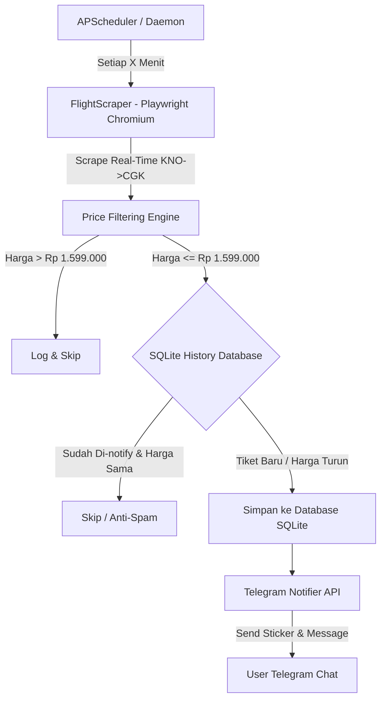

# ✈️ TicketAI - Flight Price Tracker & Telegram Notifier

[](https://www.python.org/)
[](https://core.telegram.org/bots/api)
[](https://playwright.dev/)
[](https://www.sqlite.org/)
[](https://render.com/)

Sistem otomatis cerdas untuk memantau harga tiket pesawat **sekali jalan (one-way)** rute **Kualanamu International Airport (KNO - Medan)** menuju **Soekarno-Hatta International Airport (CGK - Jakarta)** pada rentang tanggal **17, 18, 19, dan 20 September 2026**.

Sistem ini secara otomatis melakukan scraping data real-time, mengklasifikasikan deals harga, dan mengirimkan push notification berupa sinyal tiket murah ke **Telegram Bot** Anda beserta tombol langsung ke pemesanan tiket.

---

## 🌟 Fitur Utama (Features)

- 🔍 **Real-Time Data Search (Google Flights)**: Mengambil data penerbangan langsung secara *live* menggunakan Playwright Chromium tanpa *mock data*.
- 📅 **Multi-Date Tracking**: Pemantauan fleksibel untuk 4 tanggal target: **17, 18, 19, & 20 September 2026** (dapat disesuaikan via `.env`).
- 💰 **Smart Price Classification**: Filtering otomatis dengan kriteria badge harga:
  - 🚨 **SUPER CHEAP DEAL**: `< Rp 1.300.000`
  - 🟢 **DEAL BAGUS BANGET**: `Rp 1.300.000 - Rp 1.450.000`
  - 🟡 **TARGET AFFORDABLE**: `Rp 1.451.000 - Rp 1.599.000`
- 🎨 **Rich Telegram Push Notifications & Stiker**:
  - Pesan tersusun rapi (*HTML formatted*) berisi rute, jam, durasi, harga, maskapai, dan tautan pemesanan.
  - **Dukungan Stiker Telegram**: Opsional mengirimkan stiker Telegram (`sendSticker` API) sebelum sinyal tiket dikirim (`TELEGRAM_STICKER_ID`).
- 🛡️ **Anti-Spam SQLite History Engine**: Menyimpan riwayat sinyal tiket. Mencegah pengiriman pesan berulang untuk tiket & harga yang sama, namun tetap responsif jika terjadi **penurunan harga**.
- 🌐 **24/7 Cloud Ready & Built-In Health Check Server**: Dilengkapi HTTP Health Check Server (`port 10000`) dan Dockerfile agar dapat dideploy gratis 24/7 di **Render / Railway / VPS**.

---

## 🏗️ Arsitektur Sistem



---

## 💬 Contoh Notifikasi Telegram

```text
✈️ SINYAL TIKET PESAWAT MURAH!
Status: 🟢 DEAL BAGUS BANGET
Tipe: Sekali Jalan (One-Way)

📍 Rute: Medan (KNO) ➡️ Jakarta (CGK)
📅 Tanggal: 2026-09-18
💵 Harga: Rp 1.420.000

🏢 Maskapai: Batik Air (ID-6881)
🕒 Waktu: 08:30 - 10:50 (Direct)
⏱️ Durasi: 2j 20m

🔗 Klik Di Sini Untuk Pesan Tiket
-------------------------------------------
🤖 TicketAI Automated Tracker
```

---

## 🚀 Panduan Penggunaan (Quick Start)

### 1. Prasyarat System
- Python 3.10 atau versi yang lebih baru
- Node.js (untuk Playwright Chromium browser)

### 2. Instalasi & Setup

```bash
# 1. Clone repository ini
git clone https://github.com/username/TicketAI.git
cd TicketAI

# 2. Buat & aktifkan virtual environment (opsional)
python -m venv venv
# Windows:
venv\Scripts\activate
# Linux/macOS:
source venv/bin/activate

# 3. Install dependencies Python
pip install -r requirements.txt

# 4. Install Playwright Chromium Browser
playwright install chromium
```

### 3. Konfigurasi `.env`

Salin file template `.env.example` menjadi `.env`:

```bash
cp .env.example .env
```

Isi kredensial Telegram Bot Anda di file `.env`:

```ini
# Parameter Pemantauan Tiket
FLIGHT_ORIGIN=KNO
FLIGHT_DESTINATION=CGK
FLIGHT_TARGET_DATES=2026-09-17,2026-09-18,2026-09-19,2026-09-20

# Threshold Harga (IDR)
MIN_AFFORDABLE_PRICE=1300000
MAX_AFFORDABLE_PRICE=1599000

# Telegram Bot API Credentials
TELEGRAM_BOT_TOKEN=7123456789:AAFxxxxxxxxxxxxxxxxxxxx
TELEGRAM_CHAT_ID=123456789
TELEGRAM_STICKER_ID=

# Interval Penjadwalan (Menit)
CHECK_INTERVAL_MINUTES=30
```

> 💡 **Petunjuk Token Telegram:**
> 1. Cari `@BotFather` di Telegram -> kirim `/newbot` untuk buat bot baru & dapatkan **TELEGRAM_BOT_TOKEN**.
> 2. Cari `@userinfobot` di Telegram -> kirim pesan apa saja untuk mengetahui **TELEGRAM_CHAT_ID** Anda.

---

## ⚙️ Cara Menjalankan (CLI Mode)

#### 🧪 1. Uji Coba Sinyal Telegram (Test Connection)
```bash
python main.py --test-telegram
```

#### 🔍 2. Jalankan Pemantauan 1 Kali (Run Once)
```bash
python main.py --run-once
```

#### 🔄 3. Jalankan Mode Otomatis (Daemon / 24/7 Scheduler)
```bash
python main.py --daemon
```

---

## 📊 Tabel Parameter Konfigurasi (`.env`)

| Variable | Default Value | Deskripsi |
| :--- | :--- | :--- |
| `FLIGHT_ORIGIN` | `KNO` | Kode IATA bandara keberangkatan (Kualanamu) |
| `FLIGHT_DESTINATION` | `CGK` | Kode IATA bandara tujuan (Soekarno-Hatta) |
| `FLIGHT_TARGET_DATES` | `2026-09-17,...,2026-09-20` | Tanggal target penerbangan (dipisahkan koma) |
| `MIN_AFFORDABLE_PRICE` | `1300000` | Batas bawah harga deal murah (IDR) |
| `MAX_AFFORDABLE_PRICE` | `1599000` | Batas atas harga batas toleransi (IDR) |
| `TELEGRAM_BOT_TOKEN` | *Wajib* | Token HTTP API Telegram Bot |
| `TELEGRAM_CHAT_ID` | *Auto-discover* | Chat ID penerima notifikasi |
| `TELEGRAM_STICKER_ID` | *Opsional* | File ID / Unique ID Stiker Telegram |
| `CHECK_INTERVAL_MINUTES`| `30` | Interval pengecekan berkala (menit) |

---

## 🌐 Deploy 24/7 Gratis ke Cloud (Render.com)

Aplikasi ini sudah dilengkapi `Dockerfile`, `render.yaml`, dan **HTTP Health Check Server** internal (port 10000) sehingga siap dideploy ke **Render Web Service (Free Tier)**.

1. Push repository ini ke GitHub.
2. Buat **New Web Service** di [Render.com](https://render.com/).
3. Hubungkan repository GitHub Anda.
4. Set Environment Variables di Render Dashboard (`TELEGRAM_BOT_TOKEN`, `TELEGRAM_CHAT_ID`, dll).
5. Render akan secara otomatis membangun Docker Container dan menjalankan TicketAI 24/7!

---

## 📂 Struktur Berkas Project

```text
TicketAI/
├── PRD.md              # Product Requirement Document & Spesifikasi Sistem
├── README.md           # Dokumentasi Resmi Project
├── Dockerfile          # Containerization Blueprint (Playwright & Python 3.10)
├── render.yaml         # Blueprint Konfigurasi Cloud Deployment (Render.com)
├── config.py           # Central Configuration Manager
├── database.py         # SQLite Storage Engine & Anti-Spam Logic
├── notifier.py         # Telegram Bot API Notifier (Messages & Stickers)
├── scraper.py          # Playwright Real-Time Google Flights Data Engine
├── main.py             # Application Entry Point & APScheduler Daemon
├── requirements.txt    # Daftar Python Dependencies
├── .env                # File Environment & Kredensial Lokal
└── .env.example        # Template File Environment
```

---

## 📜 Lisensi
Project ini dibuat di bawah lisensi MIT. Silakan gunakan dan modifikasi sesuai kebutuhan Anda.
