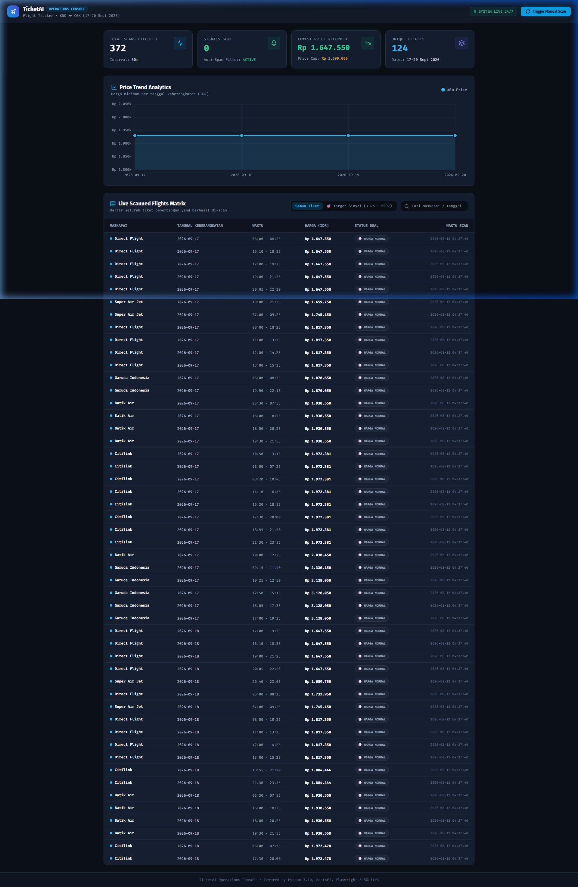
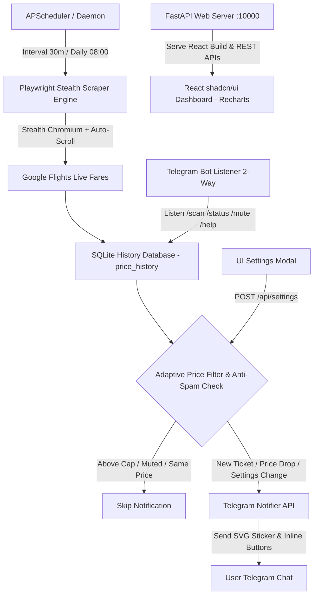

# ✈️ TicketAI - Automated Flight Tracker, React shadcn/ui Dashboard & Telegram Bot

[](https://www.python.org/)
[](https://react.dev/)
[](https://vitejs.dev/)
[](https://tailwindcss.com/)
[](https://fastapi.tiangolo.com/)
[](https://core.telegram.org/bots/api)
[](https://playwright.dev/)
[](https://www.sqlite.org/)
[](https://render.com/)

**TicketAI** adalah sistem pemantau harga tiket pesawat otomatis **100% data real-time** untuk rute **Kualanamu International Airport (KNO - Medan)** menuju **Soekarno-Hatta International Airport (CGK - Jakarta)** pada rentang tanggal **17, 18, 19, dan 20 September 2026**.

Aplikasi ini dilengkapi dengan **Playwright Stealth Scraping Engine**, **React + Vite + Tailwind CSS + shadcn/ui Dark Console V2 Web Dashboard**, **Dynamic Alert Threshold Configurator**, **Telegram Bot 2-Arah dengan Native Command Menu**, **Daily Digest Reports**, serta **Vektor SVG Stickers**.

---

## 🖥️ React shadcn/ui Operations Console V2 (`http://localhost:10000/`)



Dashboard web interaktif bertema *OLED Dark Mode* berbasis **React 19 + Vite + Tailwind CSS + Recharts + Lucide Icons** aktif di port `10000` saat aplikasi dijalankan dalam mode `--daemon`:

- 📊 **Stat Metric Cards**: Menampilkan total scan executed (`2000+`), sinyal terkirim, harga terendah recorded (`Rp 1.647.550`), dan total penerbangan unik (`134`).
- 📈 **Interactive Price Trend Analytics (Recharts)**: Grafik curva interaktif tren harga terendah per tanggal keberangkatan dengan tooltip kustom.
- 📅 **Date Selector Tabs**: Navigation tab per tanggal (`Semua Tanggal` | `17 Sept` | `18 Sept` | `19 Sept` | `20 Sept`) dengan badge harga terendah instan di setiap tanggal.
- 🔀 **Interactive Flight Matrix Table**: Tabel penerbangan real-time (Garuda Indonesia, Batik Air, Super Air Jet, Citilink, Lion Air, AirAsia) dengan sorting instan, live search, dan filter pill `[Semua Tiket]` vs `[🎯 Target Sinyal]`.
- 🎫 **Interactive Flight Detail Modal**: Klik baris tiket mana saja untuk melihat breakdown penerbangan lengkap dan tombol **"Pesan Tiket Sekarang (Google Flights)"**.
- ⚙️ **Dynamic Settings Modal**: Mengubah target harga (*Max Price Cap Target*) dan interval scan secara langsung via UI slider tanpa ubah file `.env` atau restart server.
- 🤖 **Telegram Log & Bot Test Center**: Melihat riwayat log notifikasi Telegram yang pernah terkirim dan tombol **"Send Test Signal 🚀"** untuk menguji koneksi bot.

---

## 📱 Cara Mengakses Web Dashboard dari HP (Mobile Device)

### Cara 1: Menggunakan Wi-Fi / Hotspot Lokal
1. Pastikan **HP dan Laptop terhubung ke jaringan Wi-Fi / Hotspot yang sama**.
2. Alamat IP Laptop Anda saat ini: **`192.168.1.4`**
3. Buka browser di HP Anda (Chrome, Safari, dll), lalu ketik alamat:
   👉 **`http://192.168.1.4:10000/`**

### Cara 2: Akses Global via Cloud (Render.com)
1. Buka URL Web Service Render Anda di browser HP (dapat diakses dari mana saja via 4G/5G/Wi-Fi):
   👉 **`https://ticketai-flight-tracker.onrender.com/`**

---

## 🌟 Fitur Utama (Core Features)

- ⚡ **Playwright Stealth Scraper Engine**: Pengambilan data *live* real-time dari Google Flights menggunakan Playwright Chromium dengan *stealth flags* (`--disable-blink-features=AutomationControlled`), timezone `Asia/Jakarta`, dan *auto-scrolling* untuk menangkap seluruh harga penerbangan.
- 💯 **100% Real-Time Data (No Mock Data)**: Seluruh data penerbangan dan statistik di-extract murni secara *live* dari penyedia penerbangan tanpa data sample.
- 📅 **Multi-Date Tracking**: Pemantauan 4 tanggal target: **17, 18, 19, & 20 September 2026** (configurable via `.env` atau UI Settings).
- 🎛️ **Adaptive Alert Thresholds**: Mengubah target harga secara dinamis di UI; backend secara instan mengevaluasi dan mengirim sinyal Telegram untuk seluruh tiket yang memenuhi kriteria baru.
- 🤖 **Bot Telegram Interaktif 2-Arah**:
  - `/scan` / `/check` — Menjalankan pemantauan & pengikisan tiket instan di background.
  - `/status` / `/mode` — Melihat status kesehatan bot 24/7, total scan, harga terendah, & target price cap aktif.
  - `/dates` — Melihat daftar tanggal target keberangkatan.
  - `/digest` — Mengirimkan ringkasan harian 5 tiket pesawat termurah.
  - `/help` — Menampilkan menu panduan perintah bot.
- 💙 **Native Telegram Command Menu (`setMyCommands`)**: Otomatis mendaftarkan perintah ke API Telegram sehingga tombol "Menu" biru muncul di obrolan Telegram.
- 🔘 **Telegram Inline Keyboard Buttons**:
  - `[🎫 Pesan Tiket Sekarang]` — Deep-link langsung ke pemesanan tiket.
  - `[🔕 Mute Penerbangan Ini]` — Hentikan alert berulang untuk penerbangan tertentu.
- 📊 **Daily Digest Report**: Laporan ringkasan harian otomatis setiap jam 08:00 pagi WIB mencakup harga rata-rata dan 5 tiket termurah 24 jam terakhir.
- 🎨 **Local SVG Vector Stickers**: Pengiriman stiker vektor `.svg` (`super_cheap.svg`, `good_deal.svg`, `affordable.svg`) yang disesuaikan dengan kategori deal harga.
- 🛡️ **Anti-Spam SQLite Engine**: Mencegah spam pesan berulang untuk tiket & harga yang sama, namun tetap alert saat terjadi penurunan harga baru.
- ⚡ **Vite Code-Splitting Optimization**: Performa loading ultra-cepat dengan pemisahan vendor chunks (`vendor-react`, `vendor-charts`, `vendor-icons`).

---

## 🏗️ Arsitektur Sistem



---

## 💬 Preview Notifikasi Telegram & Inline Buttons

```text
🎨 [Stiker Vektor SVG Terkirim]

✈️ SINYAL TIKET PESAWAT MURAH!
Status: 🟡 TARGET AFFORDABLE (<= Rp 1.700.000)
Tipe: Sekali Jalan (One-Way)

📍 Rute: Medan (KNO) ➡️ Jakarta (CGK)
📅 Tanggal: 2026-09-18
💵 Harga: Rp 1.647.550

🏢 Maskapai: Lion Air (-)
🕒 Waktu: 19:00 - 21:25 (Direct)
⏱️ Durasi: 2j 25m
-------------------------------------------
🤖 TicketAI Automated Tracker

[ 🎫 Pesan Tiket Sekarang ] [ 🔕 Mute Penerbangan Ini ]
```

---

## 🚀 Panduan Penggunaan (Quick Start)

### 1. Prasyarat System
- Python 3.10 atau versi yang lebih baru
- Node.js 18+ & npm

### 2. Instalasi & Setup

```bash
# 1. Clone repository ini
git clone https://github.com/felichpehagasaginting-code/FlightTracker.git
cd FlightTracker

# 2. Buat & aktifkan virtual environment (opsional)
python -m venv venv
# Windows:
venv\Scripts\activate
# Linux/macOS:
source venv/bin/activate

# 3. Install dependencies Python
pip install -r requirements.txt

# 4. Install Playwright Chromium Browser
playwright install chromium

# 5. Install frontend Node dependencies & build React app
npm install
npm run build
```

### 3. Konfigurasi `.env`

Salin file template `.env.example` menjadi `.env`:

```bash
cp .env.example .env
```

Isi kredensial Telegram Bot Anda di file `.env`:

```ini
# Parameter Pemantauan Tiket
FLIGHT_ORIGIN=KNO
FLIGHT_DESTINATION=CGK
FLIGHT_TARGET_DATES=2026-09-17,2026-09-18,2026-09-19,2026-09-20

# Threshold Harga (IDR)
MIN_AFFORDABLE_PRICE=1300000
MAX_AFFORDABLE_PRICE=1599000

# Telegram Bot API Credentials & Stiker SVG
TELEGRAM_BOT_TOKEN=8950937458:AAFxxxxxxxxxxxxxxxxxxxx
TELEGRAM_CHAT_ID=1508951127
ENABLE_SVG_STICKERS=true
ENABLE_TELEGRAM_BOT_COMMANDS=true

# Interval Penjadwalan & Server Port
CHECK_INTERVAL_MINUTES=30
PORT=10000
DAILY_DIGEST_TIME=08:00
```

---

## ⚙️ Perintah CLI (Command Line Interface)

#### 🧪 1. Uji Coba Telegram & Stiker SVG
```bash
python main.py --test-telegram
```

#### 🔍 2. Menjalankan Pemantauan 1 Kali (Run Once)
```bash
python main.py --run-once
```

#### 🔄 3. Menjalankan Mode Otomatis 24/7 (Daemon Mode & Web Dashboard)
```bash
python main.py --daemon
```

#### 💻 4. Development Mode (React Hot-Reload)
```bash
# Terminal 1: Backend FastAPI
python -m uvicorn dashboard:app --port 10000 --reload

# Terminal 2: Frontend Vite
npm run dev
# Buka http://localhost:5173 di browser
```

---

## 📊 Tabel Parameter Konfigurasi (`.env`)

| Variable | Default Value | Deskripsi |
| :--- | :--- | :--- |
| `FLIGHT_ORIGIN` | `KNO` | Kode IATA bandara keberangkatan |
| `FLIGHT_DESTINATION` | `CGK` | Kode IATA bandara tujuan |
| `FLIGHT_TARGET_DATES` | `2026-09-17,...,2026-09-20` | Tanggal target penerbangan (koma) |
| `MIN_AFFORDABLE_PRICE` | `1300000` | Batas bawah harga deal (IDR) |
| `MAX_AFFORDABLE_PRICE` | `1599000` | Batas atas harga toleransi (IDR) |
| `TELEGRAM_BOT_TOKEN` | *Wajib* | Token HTTP API Telegram Bot |
| `TELEGRAM_CHAT_ID` | *Auto-discover* | Chat ID penerima notifikasi |
| `ENABLE_SVG_STICKERS` | `true` | Kirim stiker ilustrasi SVG lokal |
| `ENABLE_TELEGRAM_BOT_COMMANDS` | `true` | Aktifkan listener bot 2-arah (`/scan`, `/status`) |
| `CHECK_INTERVAL_MINUTES`| `30` | Interval pengecekan berkala (menit) |
| `PORT` | `10000` | Port server FastAPI Dashboard & Health Check |
| `DAILY_DIGEST_TIME` | `08:00` | Jam pengiriman laporan harian (WIB) |

---

## 🌐 Deploy 24/7 Gratis ke Cloud (Render.com)

Aplikasi ini dilengkapi `Dockerfile`, `render.yaml`, dan **FastAPI Server** internal (port 10000) untuk deploy gratis di **Render.com**:

1. Push repository ke GitHub.
2. Buat **New Web Service** di [Render.com](https://render.com/).
3. Hubungkan repository GitHub Anda.
4. Set Environment Variables di Render Dashboard (`TELEGRAM_BOT_TOKEN`, `TELEGRAM_CHAT_ID`).
5. Render akan secara otomatis menjalankan TicketAI 24/7!

---

## 📂 Struktur Berkas Project

```text
TicketAI/
├── assets/
│   ├── stickers/          # Asset Stiker Vektor SVG (super_cheap.svg, good_deal.svg, dll)
│   └── dashboard_preview.png # Screenshot Tangkapan Layar Web Dashboard
├── frontend/              # Vite + React 19 + Tailwind CSS + shadcn/ui Dashboard
│   ├── src/
│   │   ├── components/    # Header, StatsCards, PriceTrendChart, FlightTable, Modals
│   │   ├── lib/           # Currency Formatters & Class Merge Utilities
│   │   ├── App.jsx        # Main React Dashboard Container
│   │   └── main.jsx       # Entry Point
│   ├── dist/              # Production Compiled Static Assets
│   └── vite.config.js     # Rollup Code-Splitting Configuration
├── PRD.md                 # Product Requirement Document & Spesifikasi Sistem
├── README.md              # Dokumentasi Resmi Project
├── Dockerfile             # Containerization Blueprint (Playwright, Node.js & Python 3.10)
├── render.yaml            # Blueprint Cloud Deployment (Render.com)
├── dashboard.py           # FastAPI Server & JSON API Endpoints
├── config.py              # Central Configuration Manager
├── database.py            # SQLite Storage Engine & Price History Analytics
├── notifier.py            # Telegram Bot API Notifier (Messages, SVG Stickers, 2-Way Bot)
├── scraper.py             # Stealth Multi-Provider Engine (Playwright + HTTP Fallback)
├── main.py                # Application Entry Point & APScheduler Daemon
├── requirements.txt       # Daftar Python Dependencies
├── package.json           # Root Delegate Build Script
├── .env                   # File Environment & Kredensial Lokal
└── .env.example           # Template File Environment
```

---

## 📜 Lisensi
Project ini dibuat di bawah lisensi MIT.
